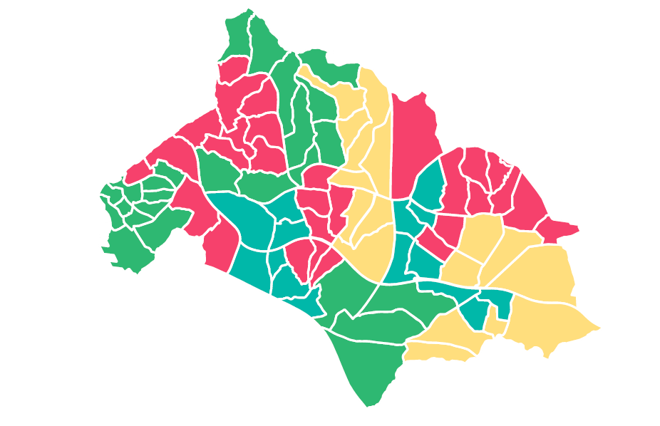
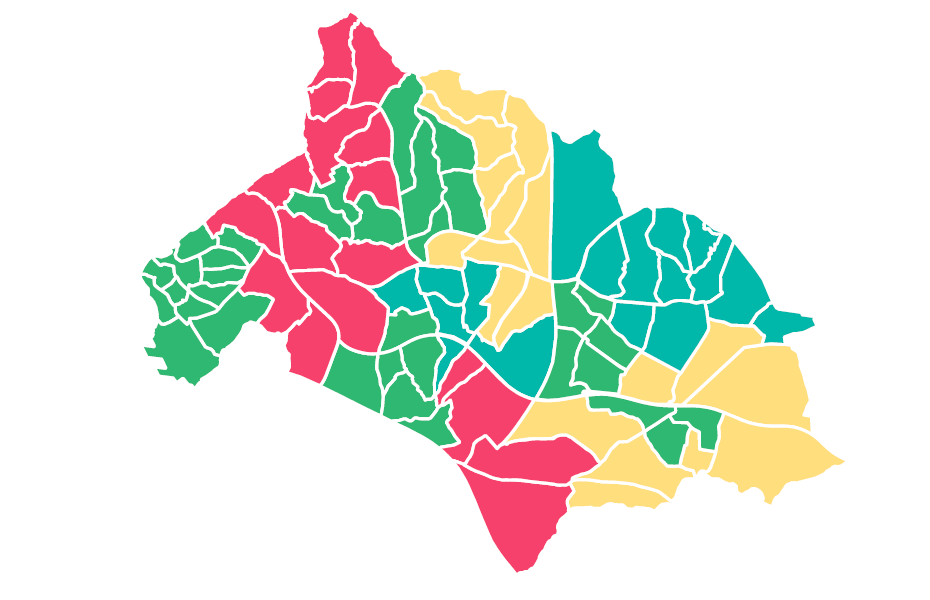

# Political-Districting-Problem
Demonstrating the Detrimental Effects of Gerrymandering with Mathematical Programming

    

        
        
This is image 2

    

    

          
        
This is image 3

    

## ABSTRACT

  Redrawing electoral district boundaries has been studied since the
  60's in several democratic countries, particularly the USA. The
  major concern in political redistricting is gerrymandering, the
  manipulation of a district's boundaries in favor of a political
  party or group. In order to prevent unfair political advantage and
  propose fair representation, the political districting literature
  has introduced several criteria such as population equality,
  contiguity, and compactness. This study develops two new
  mixed-integer mathematical programming formulations to
  quantitatively demonstrate the detrimental result of this practice
  on the political balance even when these constraints have
  been operationalized to inhibit gerrymandering. Single-member and
  mixed single- and multi-member district electoral systems are used
  in the formulations. The d'Hondt method is applied for
  proportionality representation in the mixed-member district
  formulation. To test our claim, we obtain computational results
  using the 2015 Istanbul general election and the 2017 constitutional
  referendum data. Considering our claim and the formulations to
  validate it, the study is the first of its kind to the best of our
  knowledge.

## DATA SETS

  ### Required Data Set for CPLEX Folder
  
  Each folder in this folder is for one of four territorial areas with different number of units which are 17, 33, 68, and 85.
  There are two excel files in each folder: Election and Referendum data sets. 
  
  ### Required Data Set for R Folder
  
  Required inital solutions have been achived by using the algorithm written in R programming language. Election and referendum results, adjacency matrices are used as input of the algorithm. The used data sets are same with the ones in Required Data Set for CPLEX Folder, however, form of the data sets may be different.
  
  ### Required Initial Solutions 
  
  The Excel files that cover zeros and ones are represented the initial solutions. A unit that has one value means that the unit is assigned to the district that has that one value in its column. 
  
## SOURCE CODES

  ### Mathematical Model Implementation Java Cplex
  
  You may want to change the parameters depending on the which territorial area you wants to work on.
  
  #### ProjectPD
  
  Single-member district electoral system without initialization JAVA/CPLEX implementations 
  
  #### SingleMemberWithInitialization
  
  Single-member district electoral system with initialization JAVA/CPLEX implementations 

  #### ProjectPaperMultiMemberWithout
  
  Multi-member district electoral system without initialization JAVA/CPLEX implementations 
  
  #### MultiMemberWithInitialization
  
  Multi-member district electoral system with initialization JAVA/CPLEX implementations 

  
  
  

